# Highlights


🚀 [Deployed Frontend Site](https://pp5-highlights-a86c2f8f4016.herokuapp.com/)  
💻 [Deployed API](https://drf-highlights-319d26c2d75e.herokuapp.com/)  
🔗 [API Repo](https://github.com/DanMorriss/drf-highlights)


- [Highlights](#highlights)
   * [About](#about)
   * [UX](#ux)
      + [1. Strategy](#1-strategy)
         - [User Stories](#user-stories)
      + [2. Scope](#2-scope)
      + [3. Structure](#3-structure)
      + [4. Skeleton](#4-skeleton)
         - [Wireframes](#wireframes)
      + [5. Surface](#5-surface)
   * [Features](#features)
      + [Components](#components)
         - [Asset/Spinner  ](#assetspinner)
         - [Avatar  ](#avatar)
         - [MoreDropdown & ProfileEdit Dropdown](#moredropdown-profileedit-dropdown)
         - [Navbar](#navbar)
      + [Pages](#pages)
         - [About / Landing](#about-landing)
         - [Sign up](#sign-up)
         - [Sign in](#sign-in)
         - [Feedback page](#feedback-page)
         - [Thanks](#thanks)
         - [Create a highlight](#create-a-highlight)
         - [Edit a Highlight](#edit-a-highlight)
         - [Delete a Highlight](#delete-a-highlight)
         - [View a highlight](#view-a-highlight)
         - [Feed pages](#feed-pages)
         - [Comment ](#comment)
         - [Like](#like)
         - [Profile](#profile)
         - [Edit Profile](#edit-profile)
         - [Who to follow](#who-to-follow)
         - [Follow a user](#follow-a-user)
         - [PageNotFound](#pagenotfound)
      + [Future Features](#future-features)
   * [Technologies Used](#technologies-used)
      + [Languages](#languages)
      + [Frameworks, Libraries & Tools](#frameworks-libraries-tools)
   * [Resources](#resources)
   * [Testing & Validation](#testing-validation)
   * [Bugs](#bugs)
      + [Unfixed Bugs](#unfixed-bugs)
   * [Project Setup and Initial Deployment](#project-setup-and-initial-deployment)
      + [Create a new app in Heroku.](#create-a-new-app-in-heroku)
   * [Forking the GitHub Repository](#forking-the-github-repository)
   * [Making a Local Clone](#making-a-local-clone)
   * [Credits](#credits)
      + [Images](#images)
      + [Code](#code)
      + [Acknowledgements](#acknowledgements)

## About

Highlights ia a social media platform designed to cultivate gratitude and positivity in everyday life. Inspired by the principles of the Five Minute Journal, the platform provides users with a space to share the highlights of their day and connect with others in a supportive online community.

Key Features:
- Highlight Sharing: Easily post and share the highlights of your day, complete with text descriptions and images.
- Interactive Features: Engage with other users' highlights through likes, comments, and following other users.
- Search and Discovery: Explore highlights by keywords, categories, and following other users to find inspiration and connect with like-minded individuals.
- User Profiles: View your profile and share your highlights with other users.
- Follow and Un-follow: Follow and un-follow other users to build a more engaged online community.

[Back to top](#highlights)

## UX

The five planes of Website Design were followed in the creation of this project.

### 1. Strategy

- Develop a social media platform designed to foster gratitude and enhance users perspective on life. 
- Drawing inspiration from the principal of the five minute journal, the platform aims to provide a space where individuals can share their best highlights of their day. Grounded in scientific research on the benefits of gratitude, the platform aims to cultivate a positive online community.

Key features:
- Highlight sharing: Users can post the highlights of their day, promoting reflection and appreciation for positive moments.
- Interactive Features: To encourage engagement, user have the option to add categories, attach images, and think about things they could improve on.
- Search Functionality: Users can search for highlights by content, category, or user.
- User profiles: Users can view their profile and share their highlights with other users.
- Follow and Un-follow: Users can follow and un-follow other users.

[Back to top](#highlights)

#### User Stories

For more details on the user stories go to the [projects KANBAN board](https://github.com/users/DanMorriss/projects/8)

**First Sprint**

Create an account & Login
- Landing Page
- Navbar
- Create Account
- Log in
- Log out
- Remain logged in

**Second Sprint**

Creating Highlights
- Create Highlight
- View Highlight
- Update a Highlight
- Delete Highlight

Highlight Feeds
- Highlights Feed
- Liked Highlights
- Discover Highlights

**Third Sprint**

Profile pages
- Edit Profile
- Change Password
- Who to Follow List
- User Profiles

Interactivity
- Like/un-like a Highlight
- Comment on a Highlight
- View comments
- Edit a Comment
- Delete a Comment
- Follow/un-follow a User

**Fourth Sprint**

General
- Contact Form
- Responsive site.
- Simple user navigation.
- 404 page.

[Back to top](#highlights)

### 2. Scope

- Purpose: The purpose of the website is to provide a platform for users to share the highlight of their day, fostering gratitude and a positive outlook on life. The website aims to create a supportive online community where users can connect, inspire and uplift each other.
- Target Audience: The target audience includes individuals who are interested in personal development, mindfulness, and self-improvement. This may include a diverse range of demographics, including young adults, professionals, parents, and students, who share a common interest in cultivating gratitude and positivity.
- Core Functionality:
    - Highlight sharing: Users can easily post and share the highlights of their day, including text descriptions, images, categories and things to improve your day.
    - Interactive features: The website enables users to engage with each others highlights through likes and comments, fostering a sense of community and connection.
    - Search and Discovery: Robust search functionality allows users to search for highlights by content, category, or user.
    - User profiles: Users can view each others profiles and comment on individual highlights.
    - Follow and Un-follow: Users are able to follow or un-follow other users to foster a more engaged and connected community.

[Back to top](#highlights)

### 3. Structure

For the database schema visit the [Backend API Repo](https://github.com/DanMorriss/drf-highlights#3-structure)

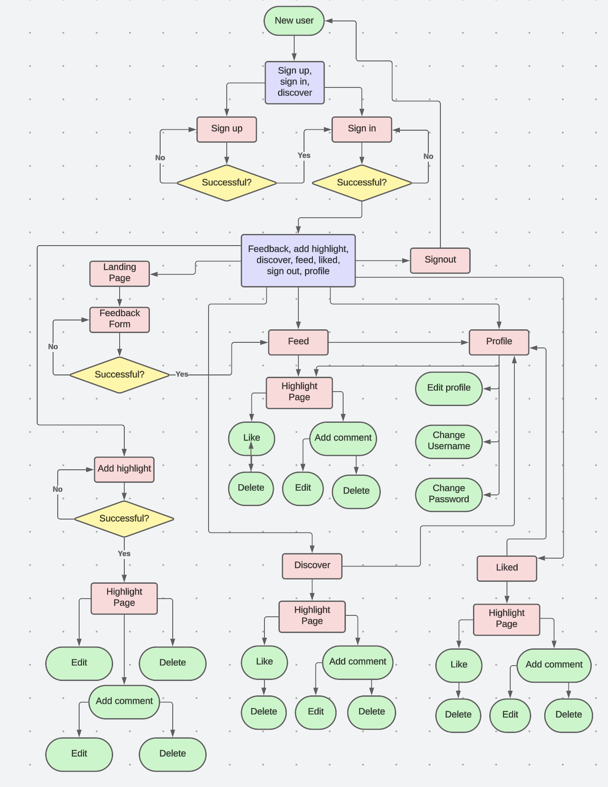
The sitemap was made using [Lucid Chart](https://lucid.app/)

[Back to top](#highlights)

### 4. Skeleton

#### Wireframes


[Canva](https://www.canva.com/en_gb/) was used to create the wireframes.

[Back to top](#highlights)

### 5. Surface

- Color and themes were based on the five minute journal, using earthy calming colors and a mix of clean and handwritten fonts.


The color palette was built using [Adobe Color](https://color.adobe.com/)
- #FFF5E6
- #DECFBC
- #453A2C
- #CDB990
- #CF8562

  
[Google Fonts](https://fonts.google.com/) supplied the fonts
- Montserrat
- Homemade Apple

[Back to top](#highlights)

## Features

### Components

#### Asset/Spinner  
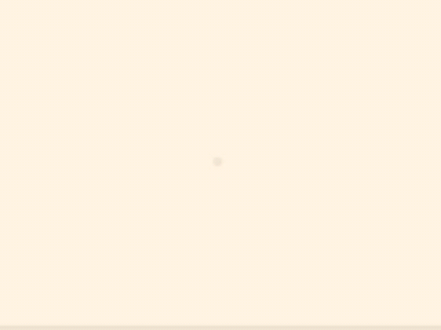

This component has 2 uses and has been used a number of times throughout the site.
- Display a loading icon when fetching data from the API
- Display an image with text, this was used on the create a highlight form for the upload image, when there are no highlights to display on the highlights page

The props are:
- spinner: if passed in a loading animation will be displayed
- src: url for an image
- message: text to go with the image

[Back to top](#highlights)

#### Avatar  
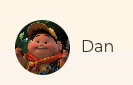

The avatar component is used throughout the site for users avatar and their username. It take the following props:
- src: a link to the image url
- height: default set to 45px
- text: Text displayed in the image is not shown. Default is set to avatar

[Back to top](#highlights)

#### MoreDropdown & ProfileEdit Dropdown
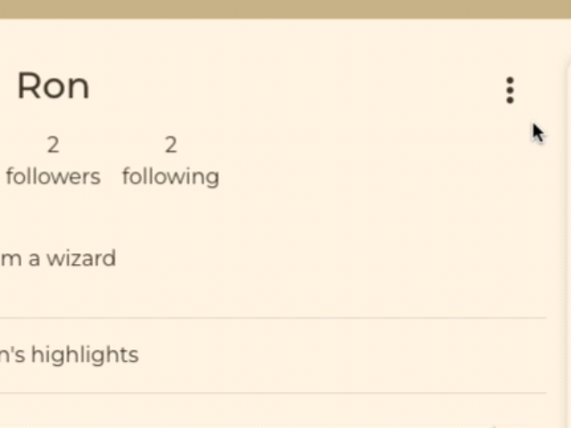

The components are shown as 3 dots when a user is able to make changed to something, like a highlight, comment or their profile. Clicking on the dots will show a dropdown menu with options for the user.

MoreDropdown options:
- Edit a highlight
- Delete a highlight

ProfileEditDropdown
- Edit profile
- Edit username
- Change password

[Back to top](#highlights)

#### Navbar

The navbar is displayed on every page on the site, but will show different options for a logged in user to a non logged in user as well as on mobile and desktop devices.

**Desktop - signed in**

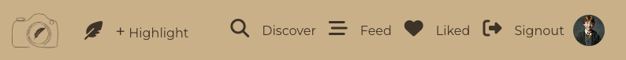

A signed in user will see the options to:
- Visit the homepage via the logo
- Add a highlight
- Visit the discover page
- Visit the feed page
- Visit the liked page
- Sign out
- Visit their profile via the avatar

**Desktop - signed out**

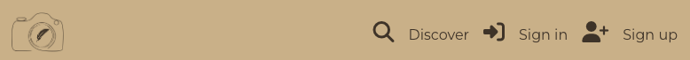

A user who is not signed in will see the following options:
- Visit the homepage via the logo
- Visit the discover page
- Sign in
- Sign up

**Mobile - singed in**

Users on a mobile device will have the same options but via a hamburger menu

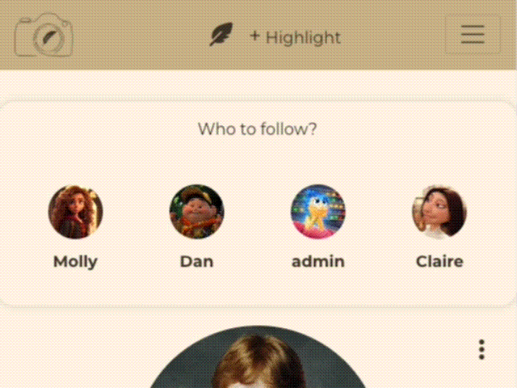

**Mobile - signed out**


[Back to top](#highlights)

### Pages

#### About / Landing

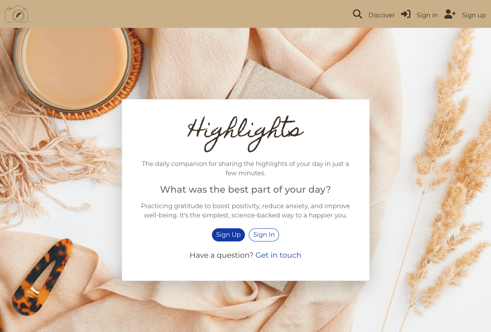

The first page a user sees when navigating to the site is the landing page with:
- Information on the site
- Link to a feedback form for a user to send a message to the site owners
- Links to sign up sign in for users who are not logged in

[Back to top](#highlights)

#### Sign up

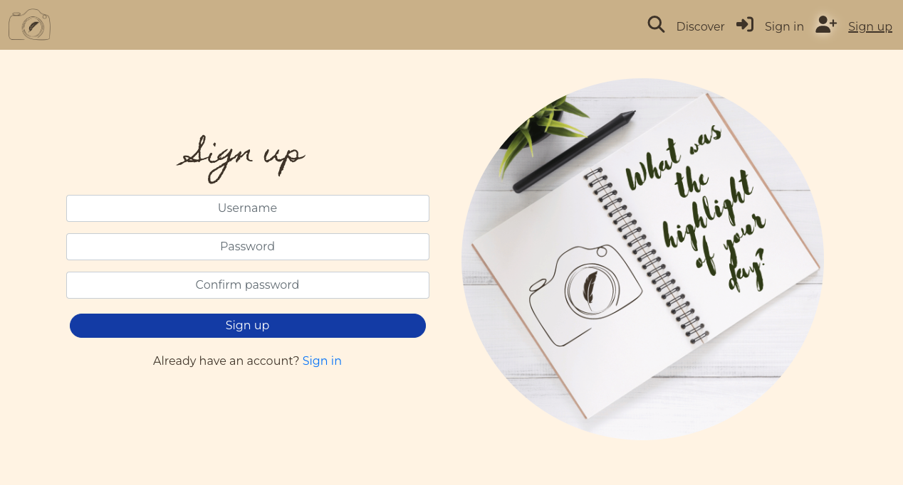
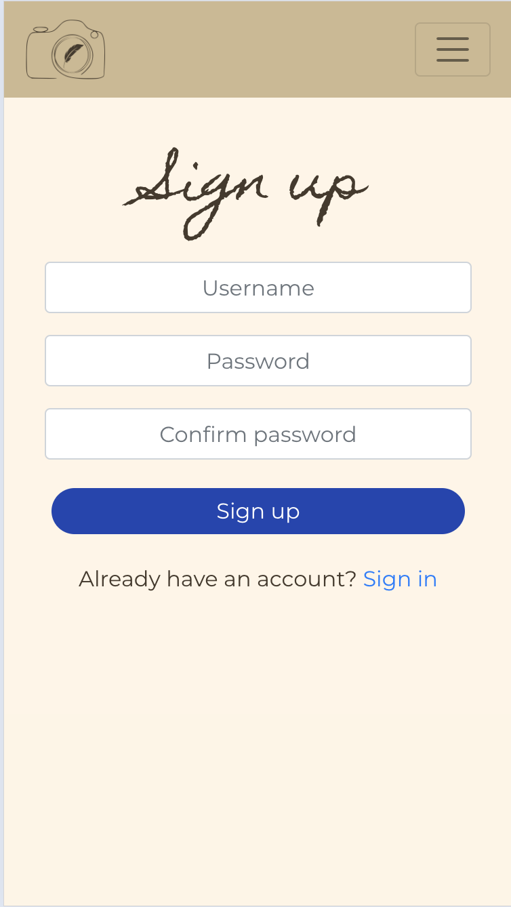

This page is accessible for non signed in users via the navbar. For a desktop user it displays:
- A form on the left
- An image on the right
For a mobile user is displays:
- A sign up form

[Back to top](#highlights)

#### Sign in

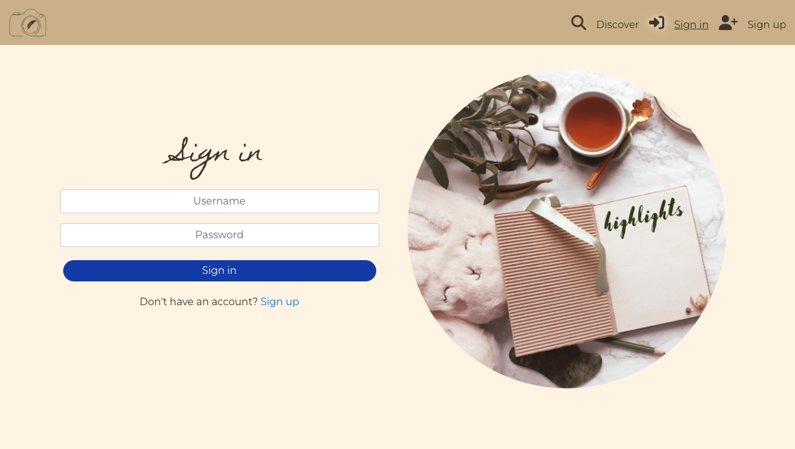
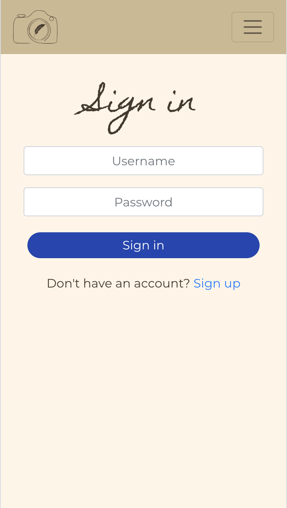

This page is accessible for non signed in users via the navbar. For a desktop user it displays:
- A form on the left
- An image on the right
For a mobile user is displays:
- A sign in form

[Back to top](#highlights)

#### Feedback page

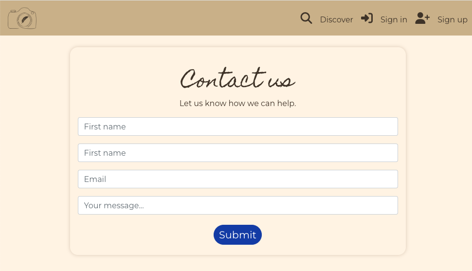

This page is accessible from the landing page and can be reached via the logo in the navbar. It contains a form for users to fill out to give feedback to the site owners.

[Back to top](#highlights)

#### Thanks

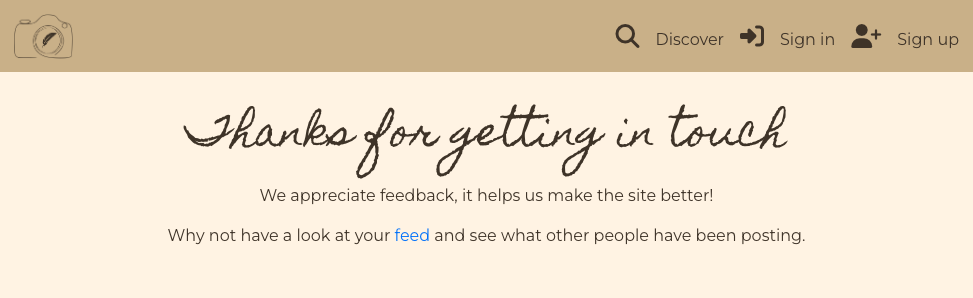

Once the user fills out the form they are taken to a thank you page so they know the message has been sent. From there they are prompted to visit the feed page.

[Back to top](#highlights)

#### Create a highlight

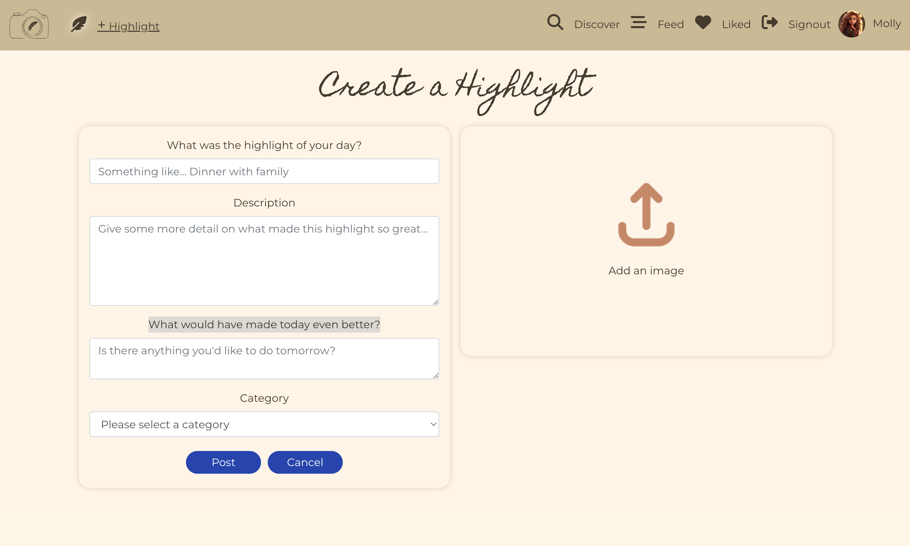

A logged in user will be able to create a highlight from the navbar and will be taken to a form with the options to add the following things to their highlight:
- Title: prompted by "What was the highlight of your day?"
- Description: for more details on the highlight
- Improve: prompted by "What would have made today even better?"
- Category: a dropdown list of predefined categories
- Image: add an image from the users device

The date will automatically be added.

[Back to top](#highlights)

#### Edit a Highlight

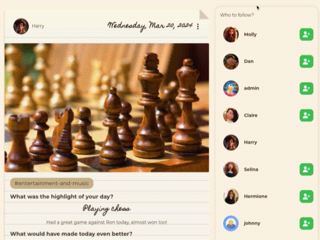

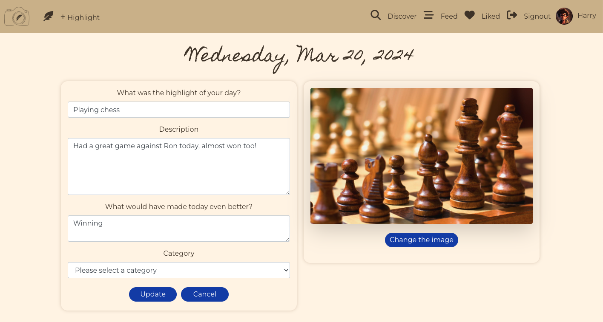

A user can edit one of their highlights via the dropdown menu in the highlight page. They are taken to a pre populated highlight form containing the details of the highlight that can all be modified.

[Back to top](#highlights)

#### Delete a Highlight

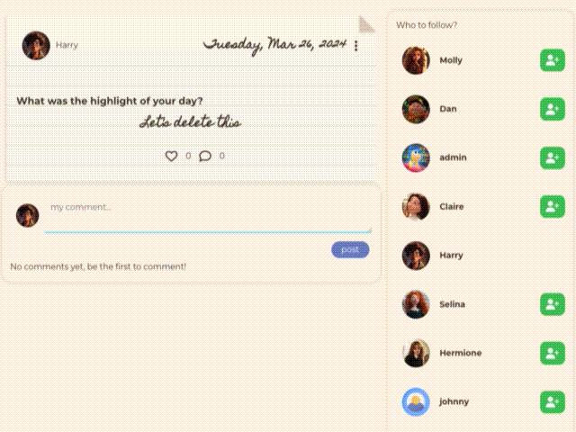

From the dropdown menu on a users highlight they also have the option to delete the highlight. Clicking on this will remove it from the site and the database then redirect the user to their feed page.

[Back to top](#highlights)

#### View a highlight
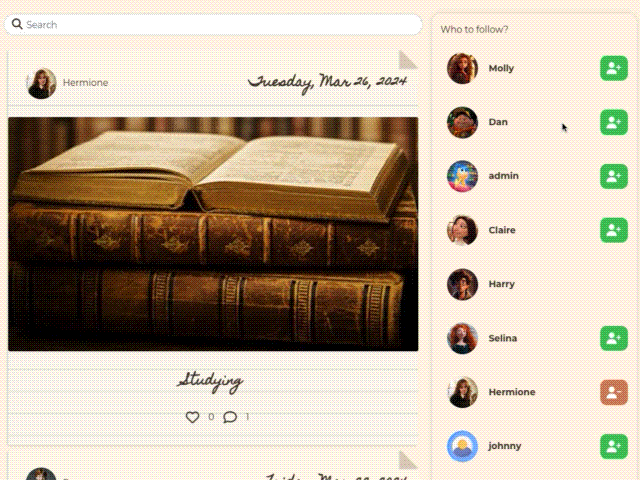

Once a highlight has been created it will show up on the discover page and any other applicable pages (feed, liked and profile). From those pages the image and date will take a user to a page for the highlight containing more detail and any comments.

The feed pages will show the following information:
- User
- Date
- Title
- Number of likes
- Number of comments

Additional information on the highlights detail page:
- Category
- Detail
- Improve

[Back to top](#highlights)

#### Feed pages


There are 4 different feed pages each containing a different filer for highlights to show:
- Discover: contains all highlights
- Feed: contains highlights from users the current user follows
- Liked: Highlights the current user has liked
- User profiles: Highlights from a single user

Each page displayed highlight from newest to oldest from top to bottom and has an infinite scroll component so the user does not have to click to a new page to see more highlights.

[Back to top](#highlights)

#### Comment 


A signed in user can add a comment to a highlight from the highlights detail page. The comment will be displayed under the highlight and can be edited or deleted by the author via the dropdown menu. Comments are displayed newest to oldest from top to bottom and have an infinite scroll component so users don't have to click to a new page to view more comments.

[Back to top](#highlights)

#### Like

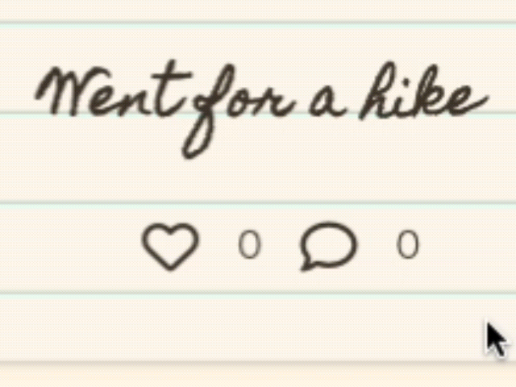

A signed in user can like a post to show support for it by clicking the heart icon at the bottom of the post. Clicking the like button will:
- Fill in the like icon to red
- Add to the like count
- Add the highlight to the users liked feed

Clicking the heart icon a second time will unlike the highlight, undoing all the actions caused by liking the highlight.

[Back to top](#highlights)

#### Profile

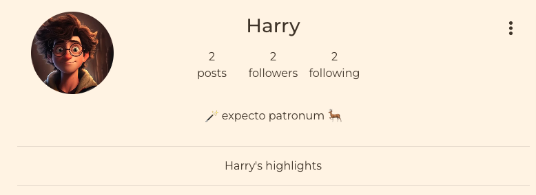

Each user has a profile page that they can access from the navbar, accessing a different users profile can be done by clicking on their avatar from one of their highlights, comments or from the who to follow section. The users profile contains the following information:
- Username
- Profile image
- Number of highlights
- Number of followers
- Number of following
- A bio
- The users highlights

[Back to top](#highlights)

#### Edit Profile

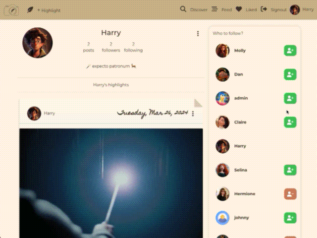

A user can edit their own profile by clicking in the 3 dots dropdown menu at the top of their profile. The following things can be added or changed:
- Username
- Bio
- Profile image
- Password

**Change Username**


**Change Password**


[Back to top](#highlights)

#### Who to follow

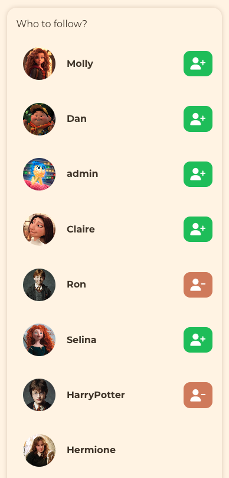

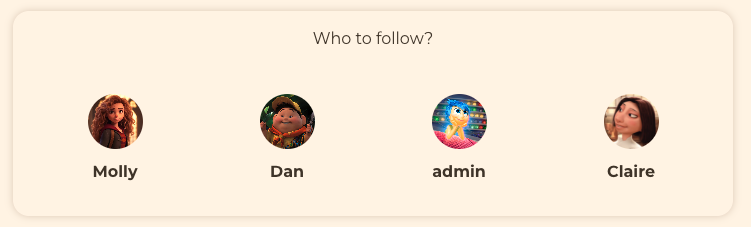

For users to see who is active on the site there is a who to follow section on the feed pages. It contains 10 profile of the most active users for desktop and 4 for mobile. It is filtered by user who have the most highlights.

[Back to top](#highlights)

#### Follow a user

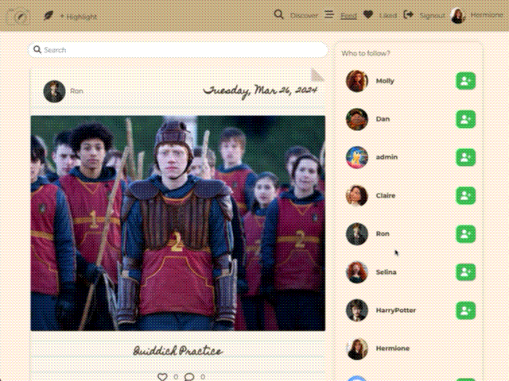

Following a user will add their highlights to the signed in users feed page and increase their following count as well as the followed users followers count. It can be done by clicking the follow button on their profile or the who to follow section. Once clicked, the button will change to an un follow button that will remove the users highlights from their feed as well as decrease the following and followers count on the respective profile pages.

[Back to top](#highlights)

#### PageNotFound

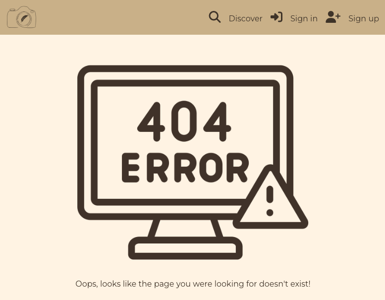

If a user navigated to an invalid url a custom 404 page will be displayed

[Back to top](#highlights)

### Future Features

Now the site is as NVP the next set of features I plan to add are:

- Location data: allow users to add location to their profile and a highlight. The model is already created in the backend for this implementation.
- Calendar view: Display a calendar on the profile page showing how often the user is posting.
- Tag users in a highlight: allow users to tag others in a highlight.

[Back to top](#highlights)

## Technologies Used

### Languages

- HTML
- CSS
- JavaScript

### Frameworks, Libraries & Tools

- [Django Rest Framework](https://www.django-rest-framework.org/) - Backend API
- [React](https://react.dev/) - Library for JS
- [React Bootstrap](https://react-bootstrap-v4.netlify.app/) - CSS libraby
- [Canva](https://www.canva.com/en_gb/) - Wire-frame and design
- [GitPod](https://gitpod.io/workspaces) - Virtual IDE
- [GitHub](https://github.com/) - Repo hosting
- [Heroku](https://dashboard.heroku.com/apps) - Deployment
- [Font Awesome](https://fontawesome.com/) - Icons
- [Google Fonts](https://fonts.google.com/) - Fonts
- [LucidChart](https://lucid.app/) - Development of flowchart
- [Chrome Dev Tools](https://developer.chrome.com/docs/devtools) - Development and bug fixing
- [Favicon.io](https://favicon.io/favicon-converter/) - Favicon conversion
- [React Router](https://v5.reactrouter.com/web/guides/quick-start) - Dynamic routing
- [React Infinite Scroll](https://www.npmjs.com/package/react-infinite-scroll-component) - for instant loading and infinite scrolling
- [Axios](https://github.com/axios/axios) - Promise-based HTTP requests
- [Adobe Color](https://color.adobe.com/) - Color Palette
- [Am I Responsive?](https://ui.dev/amiresponsive) - Multi-device mockup

Validation:
- [WC3 Validator](https://validator.w3.org/) - validate the html
- [Jigsaw W3 Validator](https://jigsaw.w3.org/css-validator/) - validate the css
- [ESLint](https://eslint.org/) - validate JS code
- [Lighthouse](https://developer.chrome.com/docs/lighthouse/overview/) - validate performance, accessibility, best practice and SEO

[Back to top](#highlights)

## Resources

- Code Institute Moments walkthrough
- React Bootstrap Docs
- Stack Overflow
- Slack Community

[Back to top](#highlights)

## Testing & Validation

For details on testing and validation view the dedicated [testing.md](./TESTING.md) file.

## Bugs

| Bug                                                                                                                                                                                                                                                                                                                                                                                                                                                                                                                                 | Solution                                                                                                                                                                                              |
|-------------------------------------------------------------------------------------------------------------------------------------------------------------------------------------------------------------------------------------------------------------------------------------------------------------------------------------------------------------------------------------------------------------------------------------------------------------------------------------------------------------------------------------|-------------------------------------------------------------------------------------------------------------------------------------------------------------------------------------------------------|
| The console was refreshing continuity when a user was not logged in in the local version of the code, in the deployed version once a successful login happened a white page was displayed and the following error was displayed to the console: `Access to XMLHttpRequest at 'https://drf-highlights-319d26c2d75e.herokuapp.com/dj-rest-auth/user/' from origin 'https://pp5-highlights-a86c2f8f4016.herokuapp.com' has been blocked by CORS policy: No 'Access-Control-Allow-Origin' header is present on the requested resource.` | Inside the CurrentUserContext.js file I was trying to return axiosReq(err.config) rather than axios(err.config). I also needed to add in Add CORS_ALLOWED_ORIGINS back into settings.py for DRF code. |
| The form for creating a highlight was throwing a 400 error when an image was not attached.                                                                                                                                                                                                                                                                                                                                                                                                                                          | I added the null=True field to the backend model but it still didn't work. So I added a check in the HighlightCreateForm to check if an image is present before appending it to the data.             |
| Trying to change the way the date is displaying on the highlights in the backend was causing the frontend form to throw a 400 error                                                                                                                                                                                                                                                                                                                                                                                                 | Moving the logic into highlights.js in the frontend fixed it.                                                                                                                                         |
| The liked page was not loading.                                                                                                                                                                                                                                                                                                                                                                                                                                                                                                     | There was a type in the filter prop in App.js, that let the liked page load.                                                                                                                          |
| The like button was not displaying the like when clicked on the feel and discover pages but the changes was reaching the database. The page needed to be reloaded to show the like/unlike.                                                                                                                                                                                                                                                                                                                                          | There were typos in the Highlight.js handleLike and handleUnlike functions.                                                                                                                           |
| The liked page was showing any result with a like, not ones that are liked by the signed in user.                                                                                                                                                                                                                                                                                                                                                                                                                                   | In the backend the filter I had setup was for like__owner__profile and I had typed likes__owner__profile in the frontend. The filters need to match, so I fixed the typo.                             |
| The HighlightEditForm was not allowing me to add or change an image. Access to XMLHttpRequest at 'https://drf-highlights-319d26c2d75e.herokuapp.com/highlights/25' from origin 'https://3000-danmorriss-highlights-4j7i000g906.ws-eu108.gitpod.io' has been blocked by CORS policy: No 'Access-Control-Allow-Origin' header is present on the requested resource. The title was not being sent wth the picture change. Then a 404 error was being thrown.                                                                           | I was missing a trailing / on the axiosReq request, adding it fixed the issue.                                                                                                                        |
| Posting a comment was throwing a 400 error.                                                                                                                                                                                                                                                                                                                                                                                                                                                                                         | I had named the highlight prop in the parent component post so the highlight field was showing up as empty.                                                                                           |
| The date was not showing up on the comments.                                                                                                                                                                                                                                                                                                                                                                                                                                                                                        | I had named the prop wrong (again). As I had made a similar mistake previously it was easy to spot and fix.                                                                                           |
| The like button was only showing a new like on a page refresh.                                                                                                                                                                                                                                                                                                                                                                                                                                                                      | I had named the method setHighlights instead of setHighlight (as I did in the parent element), renaming the method fixed it.                                                                          |
| After deleting a highlight, the user was being sent back to the editHighlight form                                                                                                                                                                                                                                                                                                                                                                                                                                                  | I sent rerouted them to the feed page instead.                                                                                                                                                        |

[Back to top](#highlights)

### Unfixed Bugs

No known unfixed bugs.

[Back to top](#highlights)

## Project Setup and Initial Deployment

- Create a new repository in GitHub.

- Create new workspace by clicking `Gitpod` button.

- Once workspace has loaded, run terminal command to create React app.  
```
npx create-react-app . --use-npm
```

- To install Bootstrap, run terminal command  
```
npm install react-bootstrap@1.6.3 bootstrap@4.6.0
```

- To run the app type the command  
```
nvm install 16 && use 16
```  
then  
```
npm start
```  

- Once the app is installed, run terminal command npm start to check app is working. Browser should open with the spinning React logo on a dark blue background.

[Back to top](#highlights)

### Create a new app in Heroku.

- Go to `Settings` and ensure that heroku/nodejs buildpack is present. If it is not, click on `Add Buildpack`, select `nodejs` and save changes.
- Click on the `Deploy` tab and go to `Deployment Method`. Click on `GitHub`.
- Go to `App connected to GitHub` and search for the relevant repository. Select that repository and click `Connect`.
- Go to `Manual Deploy` section and click `Deploy Branch`. Click on `build logs` to monitor build and ensure deployment is successful. Build is complete when log states `Build succeeded!`.
- Click `Open App` button to view newly deployed app.

[Back to top](#highlights)

## Forking the GitHub Repository

- Go to the GitHub repository
- Click on `Fork` button in top right corner
- You will then have a copy of the repository in your own GitHub account.

[Back to top](#highlights)

## Making a Local Clone

- Go to the GitHub repository
- Click the `Code` button above the list of files
- Highlight the `HTTPS` button to clone with HTTPS and copy the link
- Open the command line interface on your local computer
- Change the current working directory to the one where you want the cloned directory
- Type git clone and paste the URL from the clipboard
```
git clone https://github.com/DanMorriss/highlights.git
```
- Press Enter to create your local clone

[Back to top](#highlights)

## Credits

### Images

All images used and designs were from or created with [Canva](https://www.canva.com/en_gb/)

### Code

This project was inspired by the Code Institute moments walkthrough project. I have modified the styles and code and functionality to fit the needs of the project. Further changes are planned and can be read about further in the [future features](#future-features) section.

[Back to top](#highlights)

### Acknowledgements

- My mentor [Lauren-Nicole](https://github.com/CluelessBiker) for her advice and guidance throughout the project
- Martina Terlevic for her support over the last hurdle in stress testing and trying to break my code.
- Code Institute tutors John, Sarah & Holly for their help in fixing some hard to reach bugs
- The Code Institute Slack community for continued moral support

[Back to top](#highlights)