- [Testing & Validation](#testing-validation)
   * [Validation](#validation)
      + [HTML Validation - W3C](#html-validation-w3c)
      + [CSS Validation - Jigsaw](#css-validation-jigsaw)
      + [JavaScript Validation - ESLint](#javascript-validation-eslint)
      + [Lighthouse Validation - Accessibility](#lighthouse-validation-accessibility)
   * [Testing](#testing)
      + [Manual Testing of User Stories](#manual-testing-of-user-stories)
      + [Responsiveness](#responsiveness)
      + [Browser compatibility](#browser-compatibility)

# Testing & Validation

## Validation

The Highlights site has been passed through the following validators: 
- [WC3 HTML Validator](https://validator.w3.org/)
- [W3C Jigsaw CSS Validator](https://jigsaw.w3.org/css-validator/)
- [ESLint JavaScript Validator](https://eslint.org/)
- [Google Chrome Lighthouse Validator](https://developer.chrome.com/docs/lighthouse/overview/).

### HTML Validation - W3C

The WC3 Validator was used on the following pages.

Landing Page
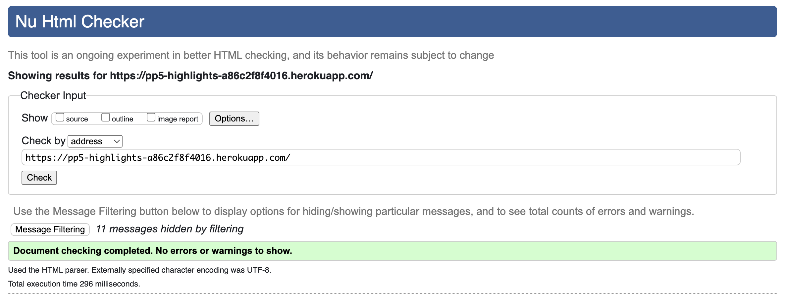

Sign up page
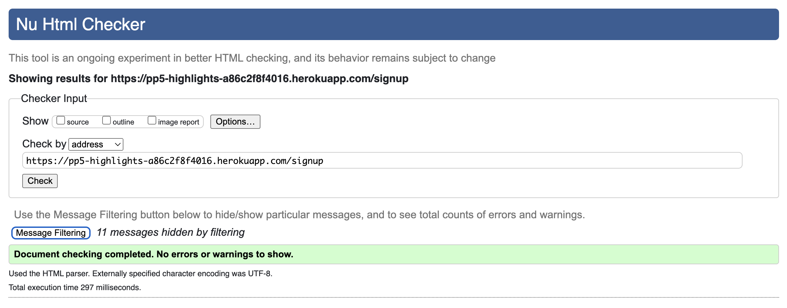

Log in page
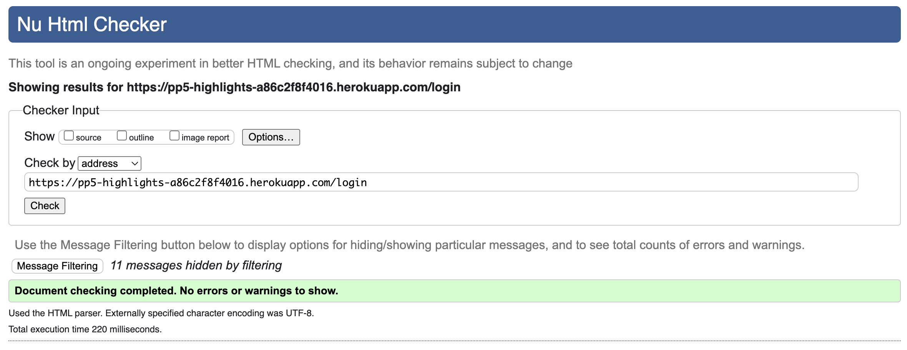

Discover page
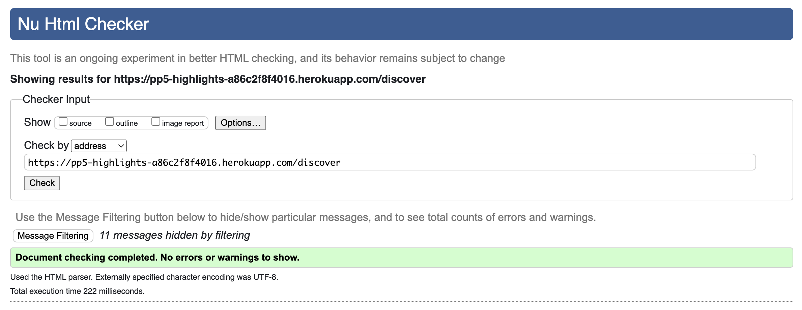

Feed page
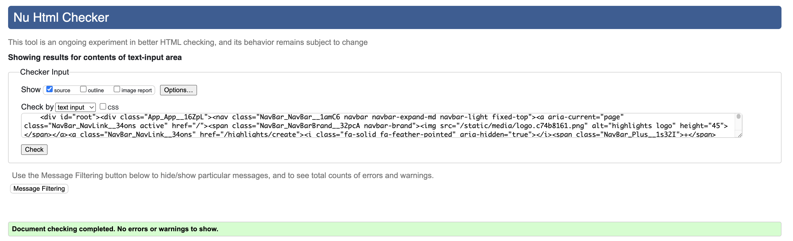

Liked page
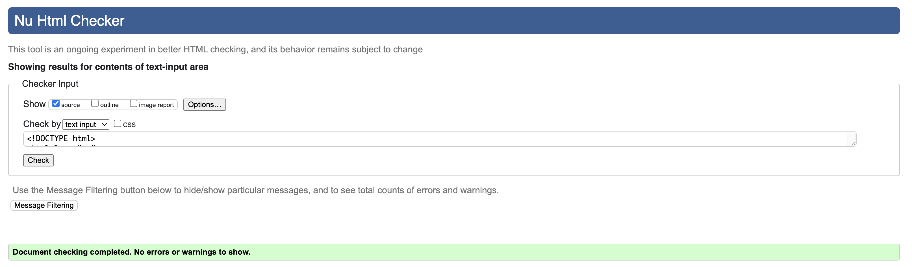

Profile page
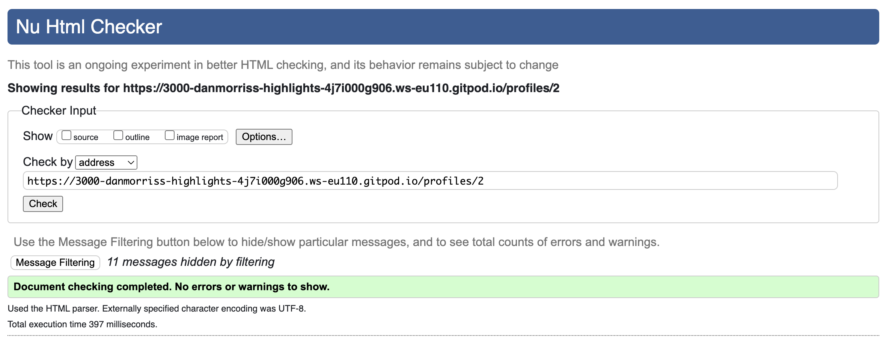

Highlight page
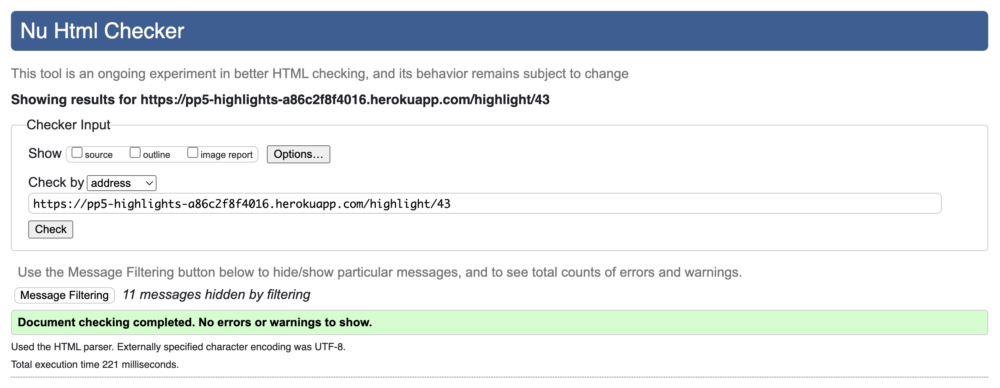

Add highlight form
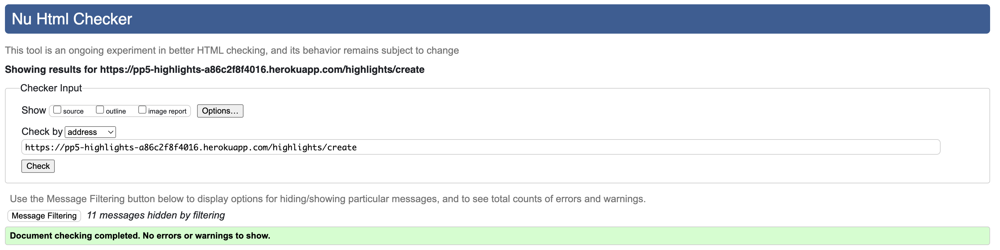

Edit highlight form
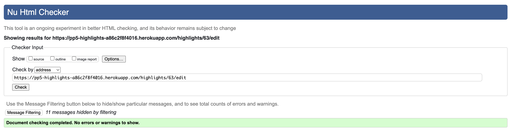

Edit profile page
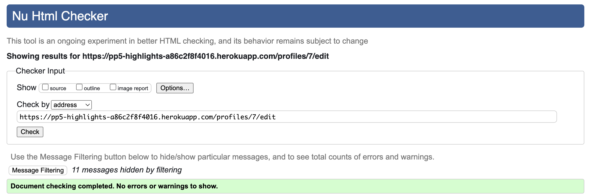

Change username page
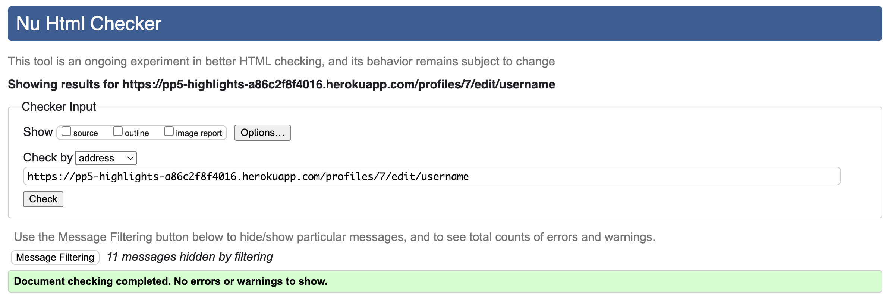

Change password page
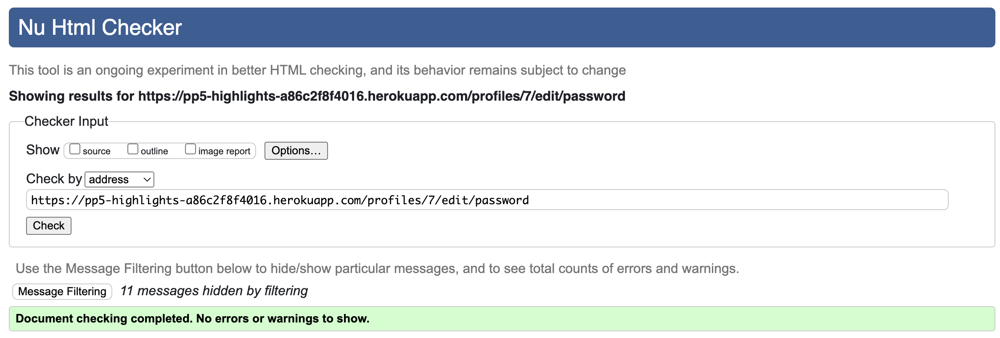

Feedback page
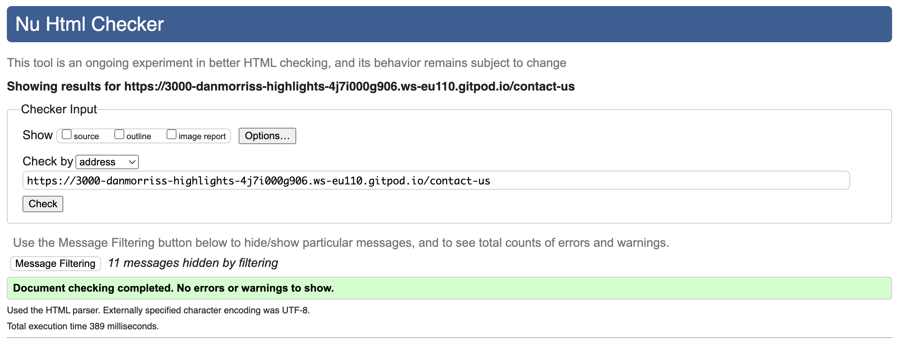

404 page
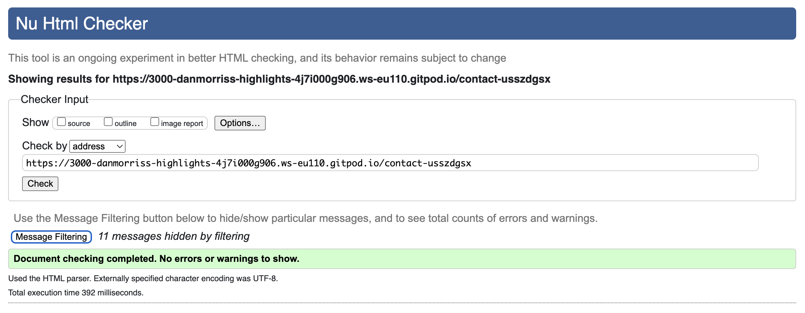

[Back to top](#testing--validation)

### CSS Validation - Jigsaw

All the pages were passed through the W3C CSS Validation Service with no errors found. 

App.module.css
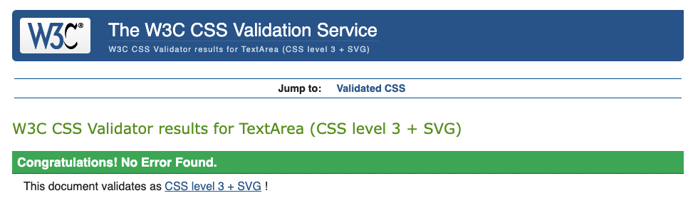

About.module.css
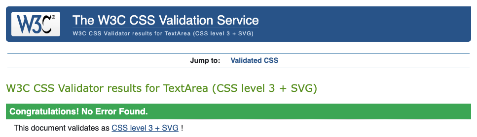

Asset.module.css
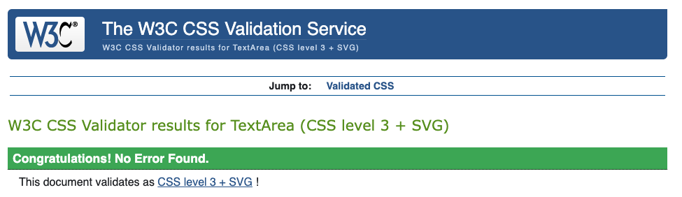

Avatar.module.css
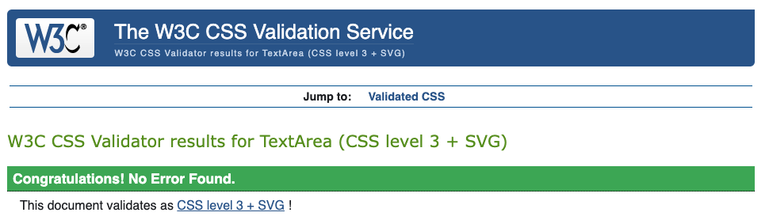

Buttons.module.css

Comment.module.css
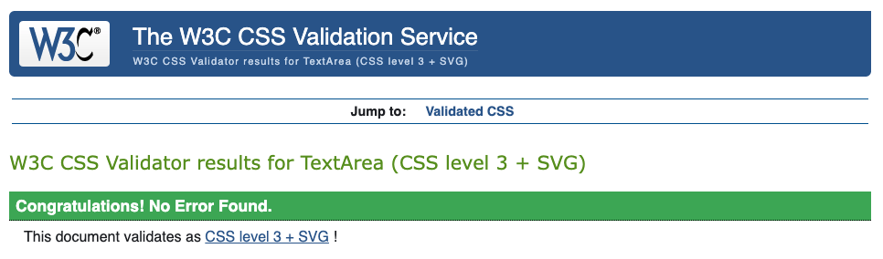

CommentCreateEditForm.module.css

Contact.module.css

Highlight.module.css
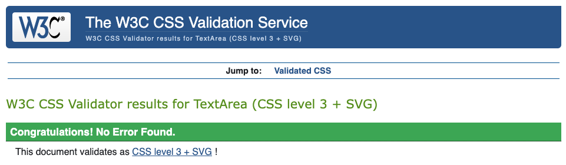

HighlightCreateEditForm.module.css
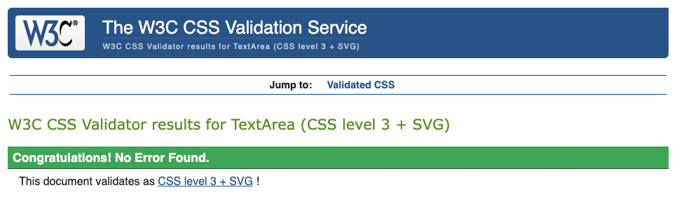

HighlightsPage.module.css
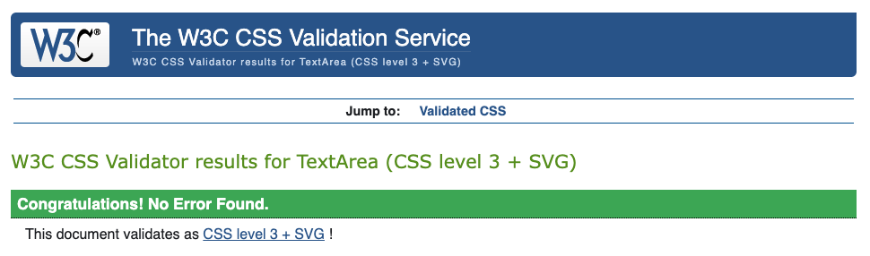

MoreDropdown.module.css

NavBar.module.css

PageNotFound.module.css

Profile.module.css
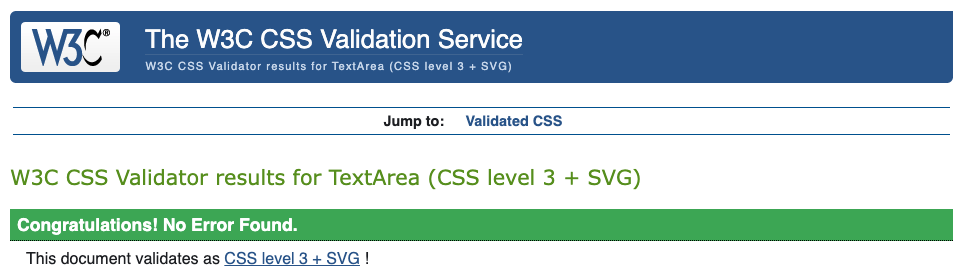

ProfilePage.module.css
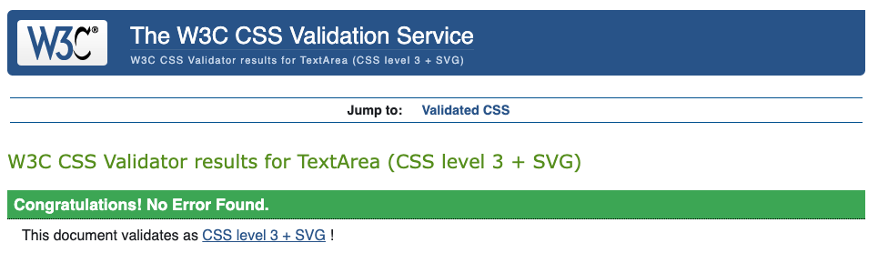

SignInForm.module.css

SignUp.module.css
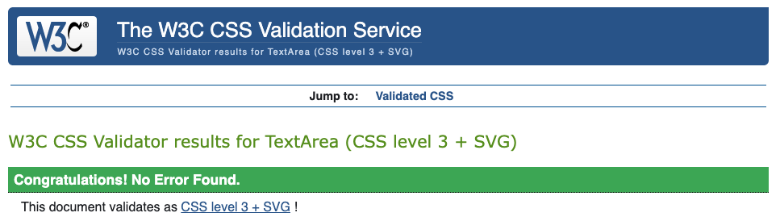

[Back to top](#testing--validation)

### JavaScript Validation - ESLint

The ESLint validator plugin was used throughout development and no errors were present on final deployment.

### Lighthouse Validation - Accessibility

The Chrome Lighthouse Dev Tool was used to test performance, accessibility, best practices and SEO on both desktop and mobile.

**Landing Page - Desktop**
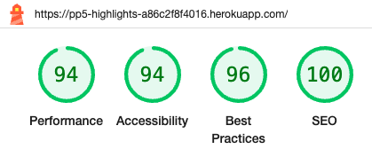

**Landing Page - Mobile**
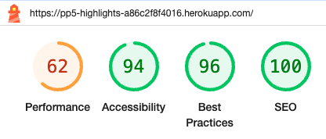

**Discover Page - Desktop**
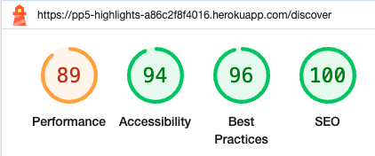

**Discover Page - Mobile**

[Back to top](#testing--validation)

## Testing

### Manual Testing of User Stories

| User Story                                                                                                    | Test                                                                                                                                                    | Expected                                                                                                                                            | Result      |
|---------------------------------------------------------------------------------------------------------------|---------------------------------------------------------------------------------------------------------------------------------------------------------|-----------------------------------------------------------------------------------------------------------------------------------------------------|-------------|
| As a user I can view the landing page with information about the platform so that I can learn more about it.  | Navigate to https://pp5-highlights-a86c2f8f4016.herokuapp.com/                                                                                          | Landing page loads                                                                                                                                  | As expected |
| As a user I can see the navbar on every page so that I can easily navigate the site.                          | As a logged in user visit all the pages on the site.                                                                                                    | Navbar is present on all pages with links to the about page via the logo, add highlight, discover, feed, liked and profile pages and a logout link. | As expected |
|                                                                                                               | As a logged out user visit all the pages on the site.                                                                                                   | Navbar is present on all pages with links to about, discover, sign in and signup pages.                                                             | As expected |
| As a new user I can create an account so that I can log in and the site features.                             | Naviagte to the sign up page and create an account.                                                                                                     | Account created and user is sent to login page.                                                                                                     | As expected |
| As a returning user I can log in to my account so that I can enjoy the features of the site.                  | Navigate to the login page, enter your account details and sign in.                                                                                     | User is sent to the feed page                                                                                                                       | As expected |
| As a user I can log out of my account so that I can keep my account secure on shared computers.               | Once logged in, click the signout link in the navbar.                                                                                                   | User is logged out and sent to the landing page.                                                                                                    | As expected |
| As a logged in user I can maintain my logged in status so that I can keep using the site.                     | Log in and wait for between 1 and 24 hours.                                                                                                             | User is still logged in.                                                                                                                            | As expected |
| As a user I can create a highlight so that I can share my thoughts and feelings.                              | Log in, navigate to the create highlight from from the navbar, fill out the form and submit.                                                            | Highlight is created and user is navigated to the highlight page.                                                                                   | As expected |
|                                                                                                               | As a logged out user naviage to https://pp5-highlights-a86c2f8f4016.herokuapp.com/highlights/create to try to create a highlight.                       | The user will be redrected to the discover page.                                                                                                    | As expected |
| As a user I can view a highlight so that I can see all the details of what I posted.                          | Click on the highlights image or date from a feed page.                                                                                                 | User is navigated to the highlihgts detail page.                                                                                                    | As expected |
| As a user I can update one of my highlights so that I can fix any mistakes I make when posting it originally. | From the highlight page of one of your highlights, click the three dots and select edit from the dropdown, then edit the highlight.                     | User is sent to the updated highlight detail page with the changes made and the rest of the highlight as it was before.                             | As expected |
|                                                                                                               | Enter the url for a post you didn't create and try to edit it. eg https://pp5-highlights-a86c2f8f4016.herokuapp.com/highlights/59/edit                  | User is redirected to the landing page.                                                                                                             |             |
| As a user I can delete one of my highlights so that I can remove it from the site.                            | Click the the dots and select the delete button from the dropdown menu.                                                                                 | The highlight is deleted and the user is sent to the feed page.                                                                                     | As expected |
| As a user I can see highlights from users I follow so that each time I visit the site the content is fresh.   | Navigate to the feed page.                                                                                                                              | View highlihgts from users I follow.                                                                                                                | As expected |
| As a user I can see highlights I have liked so that I can revisit the ones I enjoyed.                         | Like a highlight and navigate to the liked page.                                                                                                        | View the liked highlihght.                                                                                                                          | As expected |
| As a user I can search for highlights so that I can discover content I am interested in.                      | Navigate to the discover page and search for something in a highlight.                                                                                  | View only highlights with the search result in them.                                                                                                | As expected |
| As a user I can update my profile so that other users can see my information.                                 | As a signed in user click on my profile image and from my profile page click on the three dots and select edit profile, then edit profile.              | User is sent to the profile page with the changes displayed.                                                                                        | As expected |
|                                                                                                               | As a logged out user navigate to https://pp5-highlights-a86c2f8f4016.herokuapp.com/profiles/2/edit and try to edit the profile.                         | User is redirected to the landing page.                                                                                                             | As expected |
| As a user I can change my password so that I can keep my account secure.                                      | As a signed in user from your profile page click the three dots and select change password, enter a new password.                                       | Password is updated and the user is sent to back to their profile page.                                                                             | As expected |
|                                                                                                               | As a logged out user navigate to https://pp5-highlights-a86c2f8f4016.herokuapp.com/profiles/2/edit/password and try to change the password.             | User is redirected to the landing page.                                                                                                             | As expected |
| As a user I can see a list of the top profiles so that I can see who I can follow.                            | On the discover, feed, liked and profile pages view the list on the right for desktop or top for mobile.                                                | The list is populated by the top posting users.                                                                                                     | As expected |
| As a user I can view other peoples profiles so that I can find out more about them.                           | Click on a users avatar to be directed to their profile.                                                                                                | View their profile with the user information and list of their highlihgts.                                                                          | As expected |
| As a user I can like another users highlight so that I can show my support of it.                             | As a signed in user click the heart like button at the bommom of a users highlight.                                                                     | The hearts outline will become filled in and the like count will increase. The highlight will also be in the liked page.                            | As expected |
|                                                                                                               | As a logged out user click the heart on a post on the discover page.                                                                                    | Log in to like a highlight will be displayed and you will not be able to like the highlight.                                                        | As expected |
| As a user I can unlike a highlight if I liked it by mistake.                                                  | Click the filled in heart icon on a liked user highlight.                                                                                               | The heart will turn hollow, the like count will reduce by 1 and the highlight will nolonger be in the liked page.                                   | As expected |
| As a user I can comment on another user highlight so I can start a conversation.                              | As a logged in user from a highlights page enter a comment in the comment box and click post.                                                           | The comment count will increase by 1 and the comment will be displayed under the highlight.                                                         | As expected |
|                                                                                                               | As a logged out user try to add a comment to the bottom of a highlight.                                                                                 | The user will see a message telling them to log in if there are no comments and no add comment box if there are.                                    | As expected |
| As a user I can see all the comments on a highlight so that I can see what other users are saying about it.   | Click on a highlight with at least 1 comment to be taken to the highlight page.                                                                         | View the comments at the bottom of the page.                                                                                                        | As expected |
| As a user I can update a comment I made on a highlight so that I can fix any mistakes I make.                 | Click the thre button on one of your comments and edit the text, then click post.                                                                       | The comment text will be changed and displayed.                                                                                                     | As expected |
| As a user I can delete a comment I made so that I can remove it from the site.                                | Click the three buttons on one of your comments and click the delete button.                                                                            | The comment will be removed.                                                                                                                        | As expected |
| As a user I can follow a user so that I can see their highlights in my feed.                                  | Click the follow button next to a user on the who to follow section.                                                                                    | The button will change to an unfollow button and the users highlihgts will be in the feed page.                                                     | As expected |
|                                                                                                               | Click the follow button on a users profile.                                                                                                             | The followers count will increase and the users highlights will be displayed in the feed page.                                                      | As expected |
| As a user I can unfollow a user so that I no longer see their highlights in my feed.                          | Click the unfollow button of a user you a following from the who to follow list.                                                                        | The button will change to an unfollow button and the users highlights will no longer be displayed on the feed page.                                 | As expected |
|                                                                                                               | Click the unfollow button of a user you follow on their profile.                                                                                        | The button will change to an unfollow button, their follower count will reduce by 1 and their highlights will be removed from the feed page.        | As expected |
| As a site visitor I can send a message to the site owners so that I can pass on my feedback.                  | As a logged in user navigate to the landing page via the logo in the navbar and click the send us a message button, fill out the form and click submit. | The form data is sent to the API and the user is sent to a confirmation page.                                                                       | As expected |
|                                                                                                               | From the landing page click the get in touch link and fill out the form.                                                                                | The form data is sent to the API and the user is sent to a confirmation page.                                                                       | As expected |
| As a user I can view a 404 page for invalid urls so that I know the page does not exist.                      | Add some random characters to the end of the url and click enter. eg https://pp5-highlights-a86c2f8f4016.herokuapp.com/discoverdfgsd                    | A custom 404 page is displayed.                                                                                                                     | As expected |

[Back to top](#testing--validation)

### Responsiveness

All pages were tested to ensure responsiveness on screen sizes from 320px and upwards as defined in WCAG 2.1 Reflow criteria for responsive design on Chrome, Firefox and Safari.

Steps to test:

- Open browser and navigate to [Highlights](https://pp5-highlights-a86c2f8f4016.herokuapp.com/)
- Open the developer tools (right click and inspect)
- Set to responsive and decrease width to 320px
- Click and drag the responsive window slowly to maximum width

Expected:

Website is responsive on all screen sizes and no images are pixelated or stretched. No horizontal scroll is present. No elements overlap.

Actual:

Website behaved as expected.

[Back to top](#testing--validation)

### Browser compatibility

Testing has been carried out on the following browsers:

- Google Chrome
- Firefox
- Safari

[Back to top](#testing--validation)